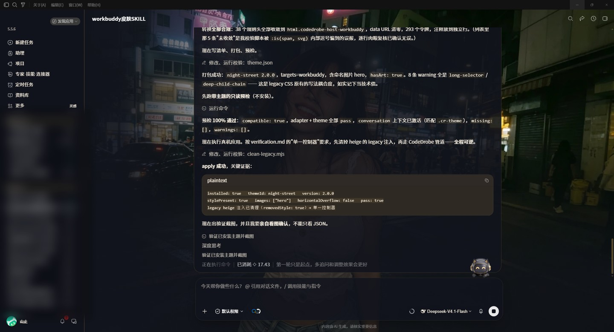
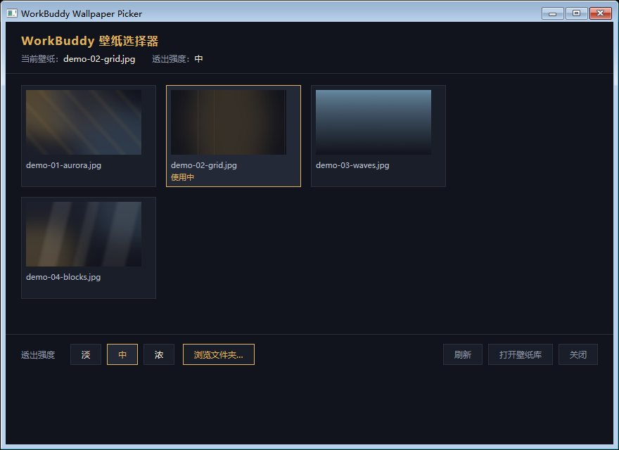
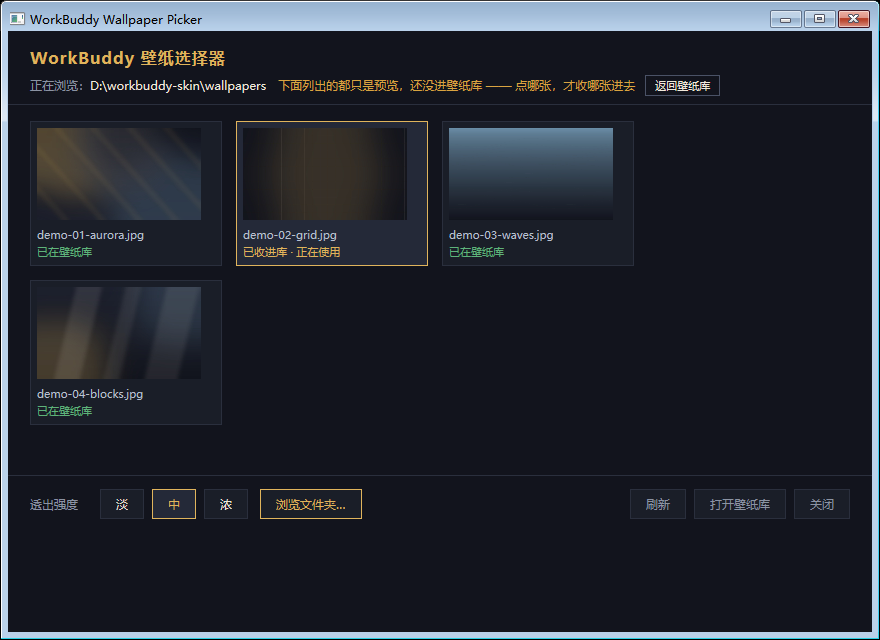
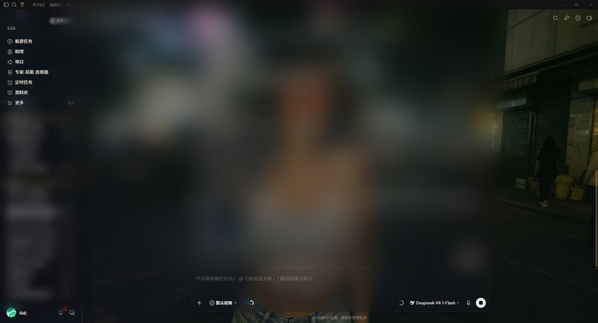
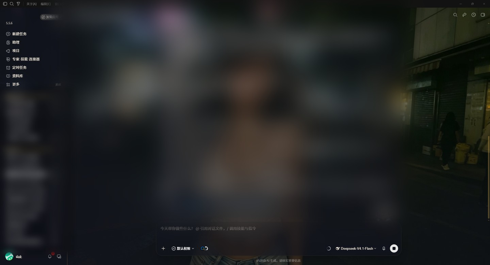
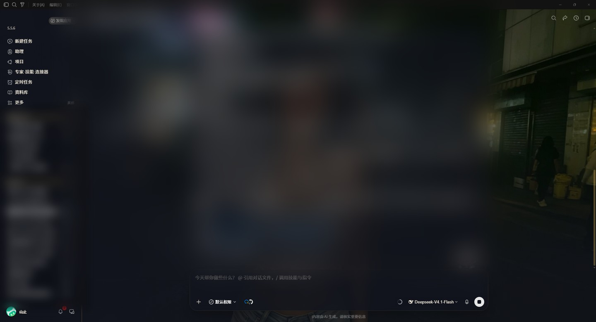

# WorkBuddy 一键换肤

给 [WorkBuddy](https://www.workbuddy.cn)（腾讯 CodeBuddy 桌面端）换一层皮肤，
并且让它**重启之后还在**。

官方不存在常驻主题的钩子 —— 注入只活在渲染进程内存里，重启必丢。
本项目用「替换启动入口 + 启动后注入一次即退」解决它：
**零常驻进程、零轮询、不改 `app.asar`**。

安装要一行命令（前置：Node ≥ 22.4、CodeDrobe CLI）；装完之后日常操作全是双击 ——
换壁纸、调透出强度、看状态、还原原生。



---

## 它做了什么

一个**自包含的换肤工程** + 一键初始化脚本。

| | |
|---|---|
| **皮肤效果** | 壁纸层 + 薄纱层 + 玻璃层，三层一起下，压住原生界面 |
| **壁纸透出强度** | 淡 / 中 / 浓 三档，改档就是一条命令 |
| **常驻** | 替换启动入口，开机自动注入 —— **零常驻进程、零轮询** |
| **随时可逆** | 还原原生一条命令；原快捷方式自动备份，可回滚 |
| **跨机器** | 工程里没有一处写死绝对路径，整体搬走仍然可用 |
| **故障边界** | 皮肤层任何环节坏掉，最坏结果只是「没皮肤」，不影响 WorkBuddy 可用性 |

上游主题引擎是成熟开源项目 **CodeDrobe Core**（[CodeDrobe/core](https://github.com/CodeDrobe/core)，Apache-2.0）。
本工程负责的是**工程化与常驻层**：把「注入一次、重启就没了」变成「装一次、以后一直在」。

---

## 一键装好

```bat
rem 1. 展开工程（把 <仓库目录> 换成你 clone 下来的路径）
node <仓库目录>\scripts\init.mjs --dest D:\my\workbuddy-skin

rem 2. 自检，12 项全绿才算装好
node D:\my\workbuddy-skin\tools\verify-launcher.mjs

rem 3. 注入皮肤（WorkBuddy 需要在运行）
双击 D:\my\workbuddy-skin\launcher\注入皮肤.cmd
```

**让皮肤每次开机自动回来**：把桌面 / 开始菜单的 WorkBuddy 快捷方式指向
`launcher\workbuddy-skin-launcher.vbs`。原来的快捷方式会自动备份到 `backup\`，随时可还原。

> 初始化脚本会依次：探测本机路径 → 展开工程 → 生成 `env.cmd` → 生成壁纸选择器
> → 构建并打包主题 → 装一张默认壁纸。每一步都打印做了什么、跳过了什么。
>
> 主程序装在非标准路径也能识别；识别不到就加 `--app "C:\...\WorkBuddy.exe"` 指定一次。

---

## 前置条件

| 项 | 要求 |
|---|---|
| 系统 | **Windows**（依赖 `.cmd` / `.vbs` / `.hta` / `.lnk`，不做跨平台） |
| Node.js | **≥ 22.4** |
| WorkBuddy | 已安装的桌面端 |
| CodeDrobe CLI | `npm install --prefix "%USERPROFILE%\.workbuddy\tools\codedrobe" @codedrobe/core` |

> 刻意**不用** `npm -g`：避免污染全局 prefix，也避免和别的工具抢版本。
>
> Node 版本不是随便定的：主题打包交给上游 `@codedrobe/core`，它声明 `engines.node >= 22.4`。
> Node 18/20 能跑本工程的脚本（探测、展开、壁纸），但走到 `theme pack` 会失败。

---

## 日常使用（全部双击）

| 想做什么 | 双击什么 | 也可以 |
|---|---|---|
| 注入皮肤（装完必做一次） | `launcher\注入皮肤.cmd` | `node tools\launcher.mjs` |
| **换壁纸**（有缩略图） | `launcher\壁纸选择器.hta` | — |
| 换壁纸（列表版） | `launcher\换壁纸.cmd` | 把图片**拖到它图标上** → 收进库并立刻启用 |
| 调壁纸透出强度 | `launcher\调强度.cmd` | 按 1/2/3 选淡 / 中 / 浓 |
| 看当前状态 | `launcher\查看状态.cmd` | `node tools\set-wallpaper.mjs list` |
| 还原成原生外观 | `launcher\还原原生.cmd` | `node tools\set-wallpaper.mjs none` |

> ⚠️ **`.cmd` / `.hta` 都得「双击」，单击只是选中。**
> 这曾经造成一次误判「点了换壁纸没反应」—— 文件被单击选中（蓝色高亮 + 右侧预览窗格），
> 脚本其实一行都没跑。

---

## 壁纸选择器

换壁纸最直观的方式：双击 `launcher\壁纸选择器.hta`。

| 壁纸库视图 | 「浏览文件夹」之后的视图 |
|---|---|
|  |  |

- Windows 原生（`mshta.exe`），**不依赖 node** —— node 坏了界面照样能开
- 带缩略图，一屏看清「已在壁纸库」和「正在使用」
- 浏览模式只列**预览**；点中哪张，才真收哪张进去（不会把整个文件夹全收进来）
- 产物是**纯 ASCII**（中文以 `\uXXXX` 转义存在）—— 从根上绕开 MSHTML 的编码坑

---

## 三档透出强度

| 档 | 遮罩 X/Y | 结构面 | 内容面 | 毛玻璃 | 适用 |
|---|---|---|---|---|---|
| **淡** `light` | 56% / 42% | 46% | 80% | 22px | 氛围优先，壁纸最抢眼 |
| **中** `medium`（默认） | 74% / 60% | 62% | 88% | 18px | 日常挂后台干活 |
| **浓** `strong` | 90% / 78% | 80% | 92% | 12px | 看代码、审 diff |

| 淡 | 中 | 浓 |
|---|---|---|
|  |  |  |

> 上面几张是整屏截图，**左侧会话列表与中间正文区已做模糊处理** ——
> 原图含私有对话内容与个人项目名，不宜公开。
> 代码块、diff、工具卡片**不参与**透明度调整，三档下都保持 80~92% 不透明 ——
> 皮肤再好看看，也不能牺牲可读性。

---

## 为什么能「重启后自动回来」

WorkBuddy 的 `supportsControlChannel` 与 CodeDrobe 的 `host.supported` **都是 false** ——
官方不存在「常驻主题」钩子，注入只活在 renderer 内存里，重启必丢。所以「持久」只有三条路：

| 方案 | 结论 |
|---|---|
| 改 `app.asar` 内资源 | ❌ 禁止。破坏包完整性、升级失效 |
| 常驻守护 + `apply --watch` 轮询 | ⚠️ 可行，但留一个常驻进程 |
| **启动器：启动后注入一次，即退** | ✅ **采用**。零常驻、零轮询 |

```
桌面 / 开始菜单 / 任务栏快捷方式（三者指向同一个启动器）
   └─> wscript.exe + workbuddy-skin-launcher.vbs      （无窗口，零闪烁）
          ├─ 步骤 1：确保应用已启动 —— sh.Run WorkBuddy.exe
          │           ↑ 不依赖 node / launcher.mjs / CDP
          └─ 步骤 2：node tools/launcher.mjs --no-launch   （纯增强层，干完即退）
                       ├─ 等 CDP 端口就绪
                       ├─ 等 renderer landmark 就绪
                       ├─ codedrobe apply --no-launch       （注入主题）
                       ├─ codedrobe verify                  （主题自检）
                       └─ 应用皮肤层：壁纸 + 薄纱 + 玻璃     ← 必须在 apply 之后
```

「启动应用」与「注入皮肤」**必须分开**：合在一起的话，node 或脚本一坏，
用户就**双击不开 WorkBuddy 了**。拆开之后 ——

| 故障 | 结果 |
|---|---|
| node 不存在 / 版本目录被换掉 | 应用正常启动，日志记 `SKIN SKIPPED`，只是没皮肤 |
| `launcher.mjs` 语法错误 / 崩溃 | 同上 |
| 主题包被删 | 应用正常启动，日志记「主题包缺失，跳过注入」 |
| CDP 端口未就绪 | 应用正常启动，只是没注入 |

---

## 目录结构

```
.
├── SKILL.md                  ← 给 AI Agent 读的操作手册（人类也能看）
├── scripts\
│   └── init.mjs              ← 一键初始化：展开工程 + 探测本机 + 生成产物
├── template\                 ← 展开到用户机器上的工程模板（35 个文件）
│   ├── launcher\             ← 用户唯一需要接触的目录（全部双击）
│   ├── tools\                ← 全部脚本
│   ├── themes\               ← 主题源（改配色改这里）
│   ├── README.md             ← 工程侧完整说明（设计取舍都写在这）
│   └── docs\                 ← 界面实拍（视觉验收留证）
└── docs\                     ← 本 README 用的展示图（已脱敏）
```

工程展开到用户机器之后长这样：

```
<工程根>\
├── launcher\     注入皮肤.cmd / 换壁纸.cmd / 调强度.cmd / 查看状态.cmd / 还原原生.cmd
│                 壁纸选择器.hta（生成物）  workbuddy-skin-launcher.vbs  env.cmd（生成物）
├── tools\        全部脚本
├── themes\<主题>\ 主题源 + assets
├── build\        主题包产物
├── wallpapers\   壁纸库 + current.json
├── backup\       原始快捷方式的备份（还原用）
└── logs\         运行日志
```

---

## 升级已有工程

```bat
node <仓库目录>\scripts\init.mjs --dest <已有工程> --upgrade
```

分界线只有一条：**代码刷成新版，用户的东西一律不动。**

| 覆盖 | 保留 |
|---|---|
| `tools\**`、`launcher\**` | `themes\**`（用户可能改过配色） |
| | `wallpapers\` `backup\` `logs\` |
| | `env.cmd`、`README.md`、`使用说明.txt` |

`--force` 与 `--upgrade` 是两件事：前者**补缺口**（不覆盖任何已有文件），
后者**换实现**（把代码刷成新版）。换机器 / 挪目录之后也要跑一次 `--upgrade`，
`env.cmd` 会按新机器重新生成。

---

## 排障

| 现象 | 怎么办 |
|---|---|
| 双击 `.cmd` 满屏「不是内部或外部命令」 | 编码或行尾不对 → 跑 `tools\_fix-cmd.ps1` |
| 快捷方式点了没反应 | 跑 `node tools\verify-launcher.mjs --only=1`；重跑 `node tools\write-env.mjs` |
| 提示「主题包不存在」 | `build\` 下没有 `.codedrobe-theme` → 重跑 `init.mjs --upgrade` |
| 皮肤注入了但界面没变 | `node tools\cdp-probe.mjs` 看 `targets` 数量（可能打到了另一个窗口） |
| 换壁纸后看不见壁纸 | 档位调到「淡」，或跑 `node tools\diag-occluders.mjs` |
| 重启后皮肤没了 | 快捷方式没指向启动器 → 按「一键装好」重新指向 |
| 壁纸选择器打开是空的 | 壁纸库还没图 → 用 `换壁纸.cmd` 拖一张进去 |
| 找不到 WorkBuddy 主程序 | `init.mjs --app "C:\...\WorkBuddy.exe"` 指定一次 |

**通用第一步**：

```bat
node <工程>\tools\verify-launcher.mjs
```

12 项自检，会直接告诉你哪一环坏了。

排障时不必全跑 —— 第 6/9/10/11 项会动真实环境（临时改主题包名、重建选择器、
拉起界面、真跑一遍 `.cmd`）。哪一环坏了就单跑哪一项，快且副作用最小：

```bat
node <工程>\tools\verify-launcher.mjs --list              rem 看各项编号
node <工程>\tools\verify-launcher.mjs --only=1,7          rem 只跑第 1、7 项
node <工程>\tools\verify-launcher.mjs --only=1,2,3,5,7,8,12   rem 只做纯静态检查
```

---

## 想改成自己的皮肤

1. 改 `themes\<主题>\assets\legacy-skin-workbuddy.css` 里的 `--heige-*` 令牌值
2. `node tools\build-theme.mjs` —— 重新生成主题 CSS（产物会自报规则块数 / 令牌数）
3. `node tools\run-codedrobe.mjs theme pack <工程>\themes\<主题>\theme.json --output <工程>\build\<id>-<版本>.codedrobe-theme`
4. `node tools\launcher.mjs` —— 注入并**看图确认**（不要只看 JSON 的 `pass: true`）
5. 视觉达标后递增 `theme.json` 的 `version`，重打包

想从**参考图**做一套全新主题，走 [CodeDrobe Theme](https://github.com/CodeDrobe/core) 的
reference-image 流程。

---

## 出处与许可

Copyright 2026 蓝晟硕（大硕）。本仓库以 [Apache-2.0](LICENSE) 授权。

- 主题引擎：[**CodeDrobe Core**](https://github.com/CodeDrobe/core) v0.6.1（Apache-2.0）
  —— 是**运行期依赖**，需自行安装（见「前置条件」），本仓库不含其源码
- 本仓库：工程化与常驻层（启动器、壁纸选择器、主题打包、路径探测、自检、排障）
- 随附主题「夜街」的素材与配色为本项目自制，含 `assets/hero.webp`。
  `template\themes\` 下的样式由本项目的 `heige-codex-skin-studio` 生成，
  **不是**从上游派生的文件 —— 只是沿用了它的 CSS 变量名与类名
  （`.cr-theme` / `--cr-*` / `--codedrobe-image-hero`）以完成互操作

许可见 [`LICENSE`](LICENSE)（Apache-2.0）与 [`NOTICE`](NOTICE)（出处与商标声明）。

更多设计取舍、踩过的坑与对照实验，见 [`template\README.md`](template/README.md)
与 [`SKILL.md`](SKILL.md)。
